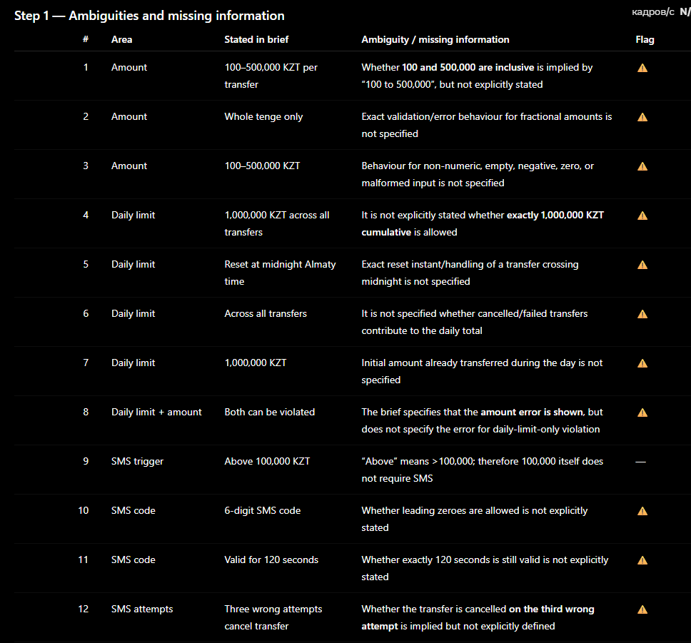
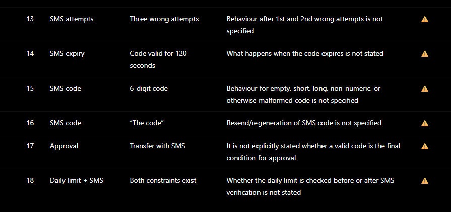
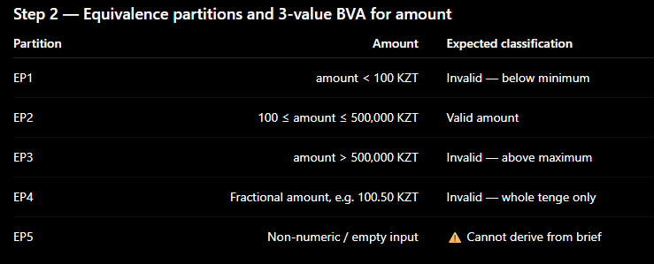
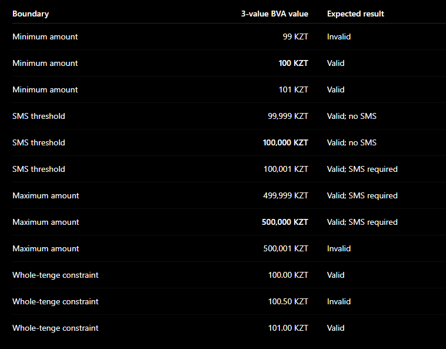
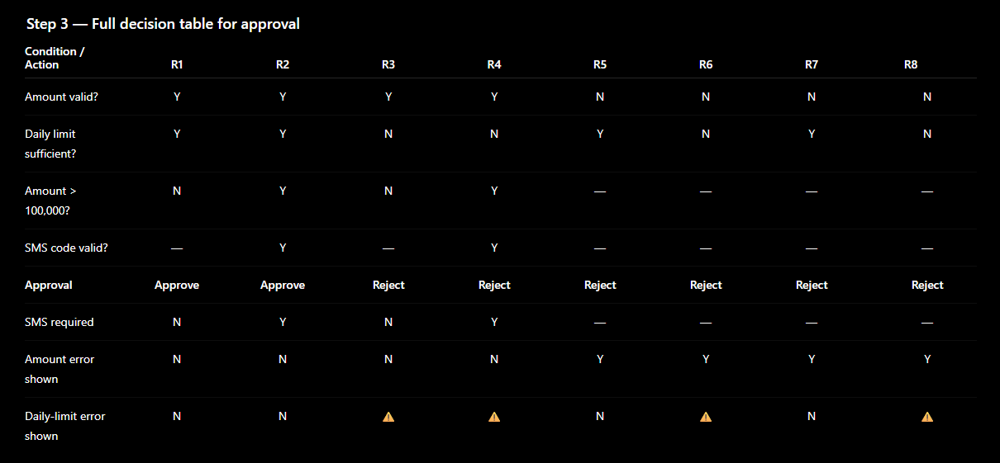
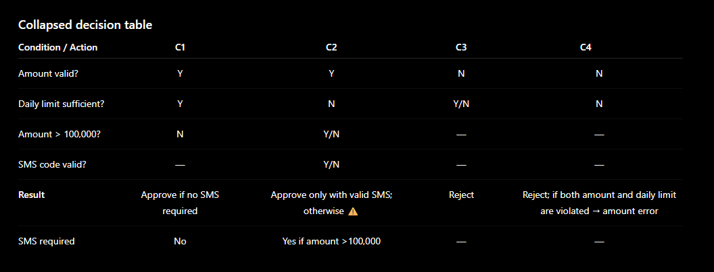
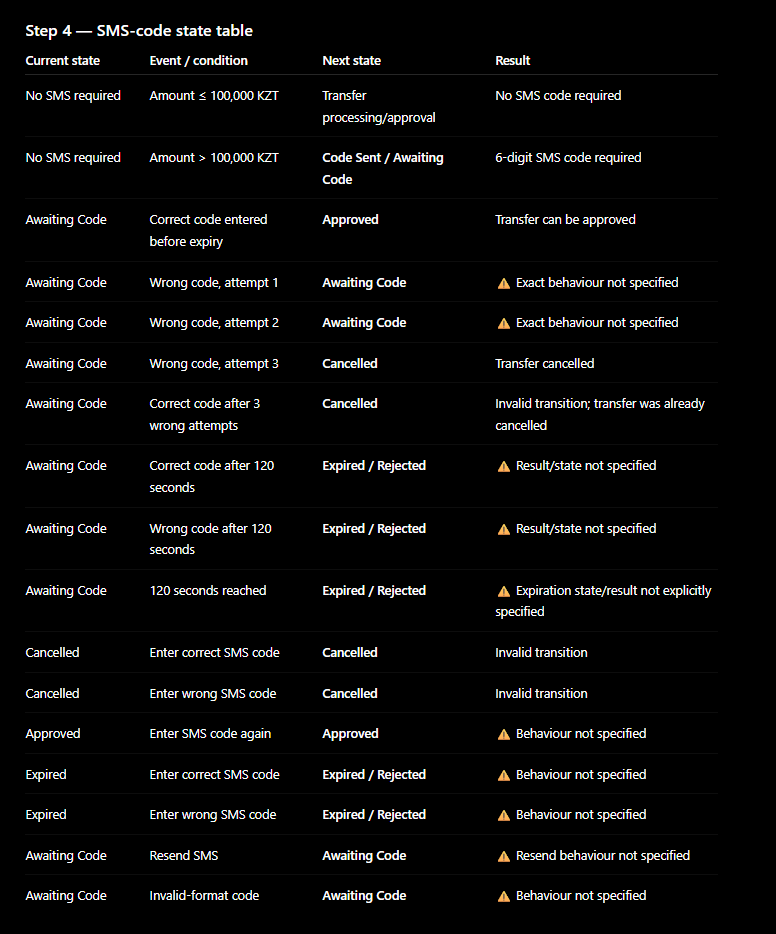

# Money Transfer QA

## 1. Test Plan

### In Scope

- Transfer amount from 100 to 500,000 KZT.
- Daily transfer limit of 1,000,000 KZT.
- 6-digit SMS code for transfers above 100,000 KZT.
- SMS code validity for 120 seconds.
- Cancellation after three wrong SMS code attempts.
- Handling of simultaneous amount and daily-limit violations.

### Out of Scope

- Functionality not specified in the transfer requirements.

### Approach

The following test design techniques are used:

- **Equivalence Partitioning and Boundary Value Analysis** for the transfer amount.
- **Decision Table Testing** for the transfer approval rules.
- **State Transition Testing** for the SMS code flow.

### Entry Criteria

Testing can start when:
- the transfer form is available;
- the transfer requirements are defined;
- the required test data is available.

### Exit Criteria

Testing can finish when:
- all planned test cases are executed;
- test results are recorded;
- no unresolved critical or high-severity defects remain, or the remaining risks are accepted;
- requirement coverage is documented.

### Top 3 Product Risks

1. A transfer above 100,000 KZT may be completed without a valid SMS code.
2. A transfer may be completed after the SMS code has expired or after three wrong attempts.
3. When both the amount limit and daily limit are violated, the wrong error may be displayed.


# 2. Test Cases

The following requirements are used for traceability.

| ID | Requirement |
|---|---|
| REQ-1 | Transfer amount must be from 100 to 500,000 KZT. |
| REQ-2 | Transfer amount must use whole KZT only. |
| REQ-3 | Daily transfer limit is 1,000,000 KZT across all transfers. |
| REQ-4 | Transfers above 100,000 KZT require a 6-digit SMS code. |
| REQ-5 | SMS code is valid for 120 seconds and three wrong attempts cancel the transfer. |
| REQ-6 | If both the amount and daily limit are violated, the amount error is shown. |
| REQ-7 | Daily transfer limit resets at midnight Almaty time. |

---

## TC-01 — Amount below minimum

**ID:** TC-01  
**Traces to:** REQ-1

### Preconditions

- Transfer form is open.
- Current daily transfer total is 0 KZT.

### Input

- Transfer amount: **99 KZT**

### Steps

1. Enter 99 KZT as the transfer amount.
2. Continue the transfer.

### Expected Result

The transfer is rejected because the amount is below 100 KZT.

### Postconditions

The transfer is not completed.

---

## TC-02 — Minimum valid amount

**ID:** TC-02  
**Traces to:** REQ-1

### Preconditions

- Transfer form is open.
- Current daily transfer total is 0 KZT.

### Input

- Transfer amount: **100 KZT**

### Steps

1. Enter 100 KZT as the transfer amount.
2. Continue the transfer.

### Expected Result

The amount is accepted and no SMS code is requested.

### Postconditions

The transfer can proceed.

---

## TC-03 — Amount below SMS threshold

**ID:** TC-03  
**Traces to:** REQ-4

### Preconditions

- Transfer form is open.
- Current daily transfer total is 0 KZT.

### Input

- Transfer amount: **99,999 KZT**

### Steps

1. Enter 99,999 KZT as the transfer amount.
2. Continue the transfer.

### Expected Result

The amount is accepted and no SMS code is requested.

### Postconditions

The transfer can proceed without SMS confirmation.

---

## TC-04 — Amount above SMS threshold

**ID:** TC-04  
**Traces to:** REQ-4

### Preconditions

- Transfer form is open.
- Current daily transfer total is 0 KZT.

### Input

- Transfer amount: **100,001 KZT**

### Steps

1. Enter 100,001 KZT as the transfer amount.
2. Continue the transfer.

### Expected Result

The amount is accepted and a 6-digit SMS code is requested.

### Postconditions

The transfer is waiting for SMS confirmation.

---

## TC-05 — Maximum valid amount

**ID:** TC-05  
**Traces to:** REQ-1 and REQ-4

### Preconditions

- Transfer form is open.
- Current daily transfer total is 0 KZT.

### Input

- Transfer amount: **500,000 KZT**

### Steps

1. Enter 500,000 KZT as the transfer amount.
2. Continue the transfer.

### Expected Result

The amount is accepted and a 6-digit SMS code is requested.

### Postconditions

The transfer is waiting for SMS confirmation.

---

## TC-06 — Amount above maximum

**ID:** TC-06  
**Traces to:** REQ-1

### Preconditions

- Transfer form is open.
- Current daily transfer total is 0 KZT.

### Input

- Transfer amount: **500,001 KZT**

### Steps

1. Enter 500,001 KZT as the transfer amount.
2. Continue the transfer.

### Expected Result

The transfer is rejected because the amount is above 500,000 KZT.

### Postconditions

The transfer is not completed.

---

## TC-07 — Transfer within daily limit

**ID:** TC-07  
**Traces to:** REQ-3

### Preconditions

- Current daily transfer total is 0 KZT.
- Transfer amount is within the allowed single-transfer range.

### Input

- Transfer amount: **50,000 KZT**

### Steps

1. Enter 50,000 KZT as the transfer amount.
2. Continue the transfer.

### Expected Result

The transfer is executed immediately.

### Postconditions

The transfer is completed.

---

## TC-08 — Daily limit exceeded

**ID:** TC-08  
**Traces to:** REQ-3

### Preconditions

- Current daily transfer total is 900,000 KZT.

### Input

- Transfer amount: **300,000 KZT**

### Steps

1. Enter 300,000 KZT as the transfer amount.
2. Continue the transfer.

### Expected Result

The transfer is rejected because the daily limit of 1,000,000 KZT would be exceeded.

### Postconditions

The transfer is not completed.

---

## TC-09 — Both amount and daily limit are violated

**ID:** TC-09  
**Traces to:** REQ-6

### Preconditions

- Current daily transfer total is 900,000 KZT.

### Input

- Transfer amount: **500,001 KZT**

### Steps

1. Enter 500,001 KZT as the transfer amount.
2. Continue the transfer.

### Expected Result

The amount error is displayed.

### Postconditions

The transfer is not completed.

---

## TC-10 — Correct SMS code

**ID:** TC-10  
**Traces to:** REQ-4 and REQ-5

### Preconditions

- Transfer amount is 200,000 KZT.
- SMS confirmation is required.
- SMS code screen is displayed.

### Input

- Correct 6-digit SMS code.

### Steps

1. Enter the correct SMS code.
2. Confirm the transfer.

### Expected Result

The transfer is confirmed.

### Postconditions

The transfer is completed.

---

## TC-11 — Three wrong SMS codes

**ID:** TC-11  
**Traces to:** REQ-5

### Preconditions

- Transfer amount is 200,000 KZT.
- SMS confirmation is required.
- SMS code screen is displayed.

### Input

- Three incorrect SMS codes.

### Steps

1. Enter an incorrect SMS code.
2. Enter another incorrect SMS code.
3. Enter a third incorrect SMS code.

### Expected Result

The transfer is cancelled after the third incorrect attempt.

### Postconditions

The transfer cannot be confirmed.

---

## TC-12 — SMS code expiration

**ID:** TC-12  
**Traces to:** REQ-5

### Preconditions

- Transfer amount is 200,000 KZT.
- SMS confirmation is required.
- SMS code screen is displayed.

### Steps

1. Do not enter the SMS code.
2. Wait until the 120-second validity period expires.
3. Enter the previously received SMS code.

### Expected Result

The expired SMS code does not confirm the transfer.

### Postconditions

The transfer is not confirmed.

---

# 3. Traceability Matrix

| Requirement | Test Cases | Status |
|---|---|---|
| REQ-1 — Amount 100–500,000 KZT | TC-01, TC-02, TC-05, TC-06 | Covered |
| REQ-2 — Whole KZT only | — | **NOT COVERED** |
| REQ-3 — Daily limit 1,000,000 KZT | TC-07, TC-08 | Covered |
| REQ-4 — SMS required above 100,000 KZT | TC-03, TC-04, TC-05, TC-10 | Covered |
| REQ-5 — 120 seconds / three wrong attempts | TC-10, TC-11, TC-12 | Covered |
| REQ-6 — Amount error when both limits are violated | TC-09 | Covered |
| REQ-7 — Daily limit reset at midnight Almaty time | — | **NOT COVERED** |

### Uncovered Requirements

**REQ-2 — Whole KZT only**

No test case checks a fractional amount such as 100.50 KZT. This behaviour was not included in the selected 12 test cases.

**REQ-7 — Daily limit reset**

No test case checks the transition at midnight Almaty time. This behaviour was identified in the requirements but was not included in the selected 12 test cases.

---

# 4. SMS Code Flow — Release Checklist

- [ ] SMS code is requested for transfers above 100,000 KZT.
- [ ] SMS code is not requested for transfers of 100,000 KZT or less.
- [ ] SMS code contains 6 digits.
- [ ] Correct SMS code confirms the transfer.
- [ ] Wrong SMS code does not confirm the transfer.
- [ ] Third wrong SMS code attempt cancels the transfer.
- [ ] SMS code expires after 120 seconds.
- [ ] Expired SMS code cannot confirm the transfer.
- [ ] A cancelled transfer cannot be confirmed using the SMS code.
- [ ] A confirmed transfer is not cancelled when the SMS timer expires.

---

# 5. Defect Reports

## DEF-001 — Expired SMS code confirms transfer

**Environment:** Mock test environment

### Preconditions

- Transfer amount is 200,000 KZT.
- SMS confirmation is required.
- SMS code screen is displayed.

### Steps to Reproduce

1. Start a transfer of 200,000 KZT.
2. Continue to the SMS confirmation screen.
3. Wait until the 120-second validity period expires.
4. Enter the previously received SMS code.

### Expected Result

The expired SMS code is rejected and the transfer is not confirmed.

### Actual Result

The transfer is confirmed using the expired SMS code.

### Reproducibility

5/5 in the mock scenario.

### Severity

High

### Priority

High

### Evidence

Mock test result.

### Traces to

REQ-5 / TC-12

---

## DEF-002 — Transfer can be confirmed after three wrong SMS attempts

**Environment:** Mock test environment

### Preconditions

- Transfer amount is 200,000 KZT.
- SMS confirmation is required.
- SMS code screen is displayed.

### Steps to Reproduce

1. Start a transfer of 200,000 KZT.
2. Continue to the SMS confirmation screen.
3. Enter an incorrect SMS code.
4. Enter another incorrect SMS code.
5. Enter a third incorrect SMS code.
6. Enter the correct SMS code.

### Expected Result

The transfer is cancelled after the third incorrect attempt and cannot be confirmed.

### Actual Result

The correct SMS code confirms the transfer after the third incorrect attempt.

### Reproducibility

5/5 in the mock scenario.

### Severity

High

### Priority

High

### Evidence

Mock test result.

### Traces to

REQ-5 / TC-11

---

## DEF-003 — Wrong error is displayed when both limits are violated

**Environment:** Mock test environment

### Preconditions

- Current daily transfer total is 900,000 KZT.

### Steps to Reproduce

1. Open the transfer form.
2. Enter 500,001 KZT.
3. Continue the transfer.

### Expected Result

The amount error is displayed.

### Actual Result

The daily limit error is displayed instead of the amount error.

### Reproducibility

5/5 in the mock scenario.

### Severity

Medium

### Priority

High

### Evidence

Mock test result.

### Traces to

REQ-6 / TC-09


# 6. AI Appendix

## 6.1 Prompt Used

```text
You are a senior QA engineer. Here is a requirement: 

*Amount: 100 to 500,000 KZT per transfer, whole tenge only. 
*Daily limit: 1,000,000 KZT across all transfers, reset at midnight Almaty time. 
*Transfers above 100,000 KZT require a 6-digit SMS code. 
*The code is valid for 120 seconds. Three wrong attempts cancel the transfer. 
*If the amount and the daily limit are both violated, the amount error is shown.

Step 1. List every ambiguity and missing piece of information.
Do not invent behaviour the brief does not state.

Step 2. Apply equivalence partitioning and 3-value boundary value
analysis to the amount. Show the partitions and the boundary values.

Step 3. Build the full decision table for approval, then the collapsed one.

Step 4. Write the state table for the SMS code, including invalid transitions.

Output tables only.
Flag any test case you could not derive from the brief.
```

## 6.2 Raw AI Output









## 6.3 What Was Changed and Why

The AI output was compared with the requirements and with the manually completed analysis.

### Task A

The original analysis focused on the specified transfer amount range and the SMS threshold.

The AI expanded the analysis with additional input-format checks, such as integer and other input-format cases.

These additional cases were not added to the final test documentation because they were not part of the specified behaviour used for the selected test cases.

### Task B

The original decision table used three conditions and was then reduced to four relevant combinations.

The AI used an additional condition and produced a more extensive table. It also identified additional ambiguities.

The additional conditions were not turned into new requirements because they were not explicitly specified.

### Task C

The original analysis covered the SMS states, valid transitions, expiration and the three most dangerous invalid transitions.

The AI expanded the state analysis with additional sequences and potential risks.

Some of these scenarios were not included in the final documentation because they were not described in the requirements.

### Final Decision

The AI output was used as a supporting analysis tool.

The final documentation keeps the requirements and test scenarios that can be directly supported by the specification. Additional behaviour suggested by the AI was not treated as a requirement unless it was specified in the brief.
